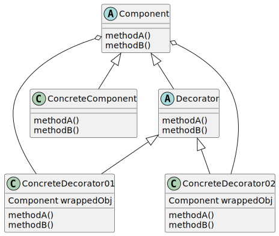
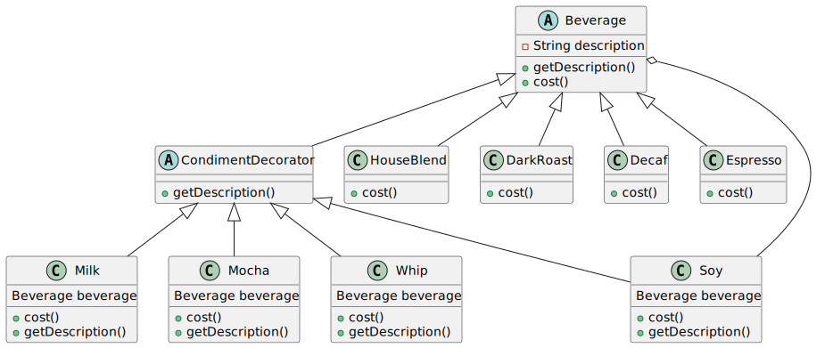
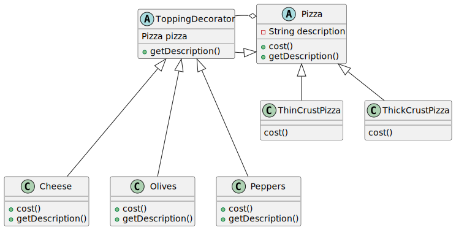
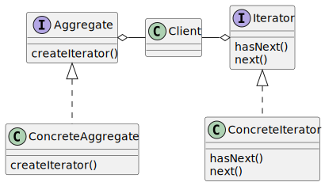
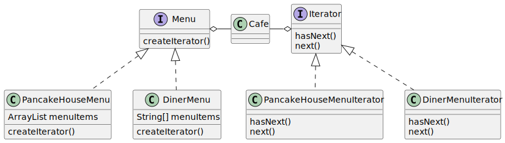

# Design Patterns
This repo contains all simple source code  to demonstrate design patterns
## Strategy Pattern
### Classical Duck Example

## Adapter Pattern

## Observer Pattern

## Decorator Pattern

## Iterator Pattern

